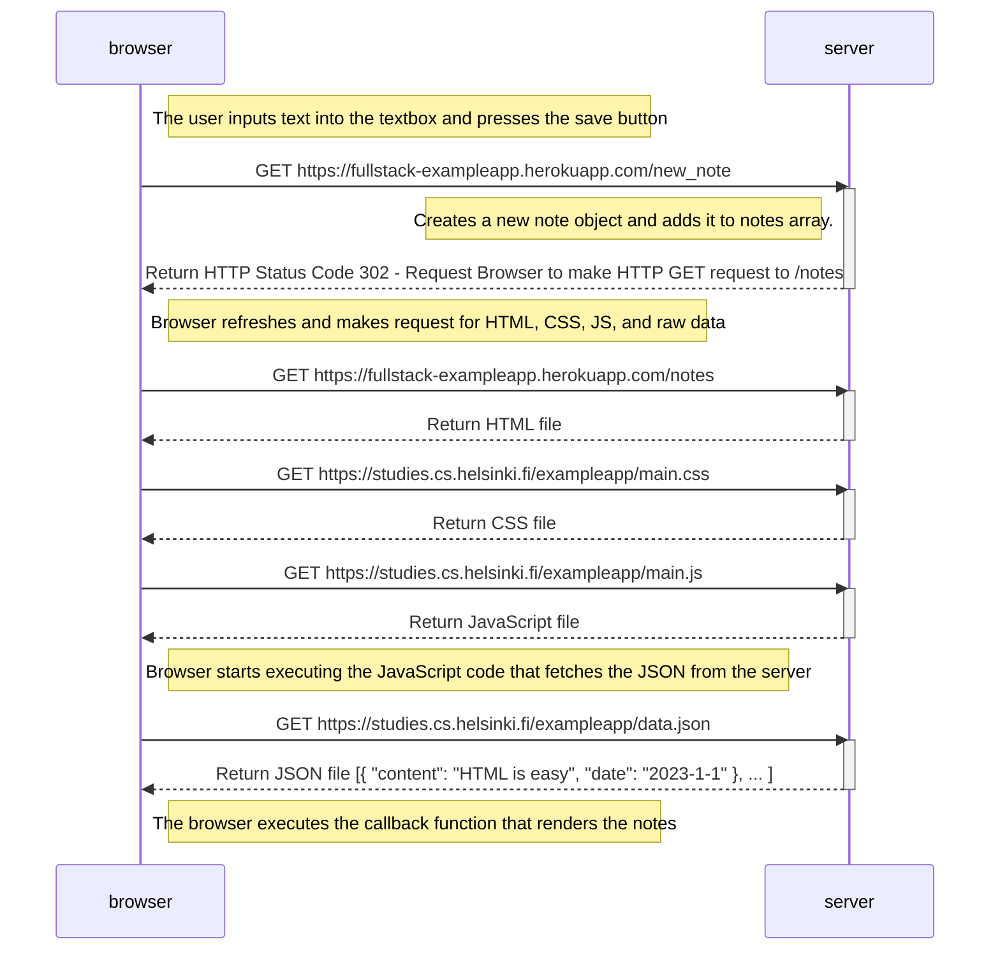

```mermaid
sequenceDiagram
    participant browser
    participant server

    Note right of browser: The user inputs text into the textbox and presses the save button
    browser->>server: GET https://fullstack-exampleapp.herokuapp.com/new_note
    activate server

 
    Note left of server: Creates a new note object and adds it to notes array.
    server-->>browser: Return HTTP Status Code 302 - Request Browser to make HTTP GET request to /notes
    deactivate server
    Note right of browser: Browser refreshes and makes request for HTML, CSS, JS, and raw data
    browser->>server: GET https://fullstack-exampleapp.herokuapp.com/notes
    activate server
    server-->>browser: Return HTML file
    deactivate server

    browser->>server: GET https://studies.cs.helsinki.fi/exampleapp/main.css
    activate server
    server-->>browser: Return CSS file
    deactivate server

    browser->>server: GET https://studies.cs.helsinki.fi/exampleapp/main.js
    activate server
    server-->>browser: Return JavaScript file
    deactivate server
    Note right of browser: Browser starts executing the JavaScript code that fetches the JSON from the server

    browser->>server: GET https://studies.cs.helsinki.fi/exampleapp/data.json
    activate server
    server-->>browser: Return JSON file [{ "content": "HTML is easy", "date": "2023-1-1" }, ... ]
    deactivate server

    Note right of browser: The browser executes the callback function that renders the notes
```
