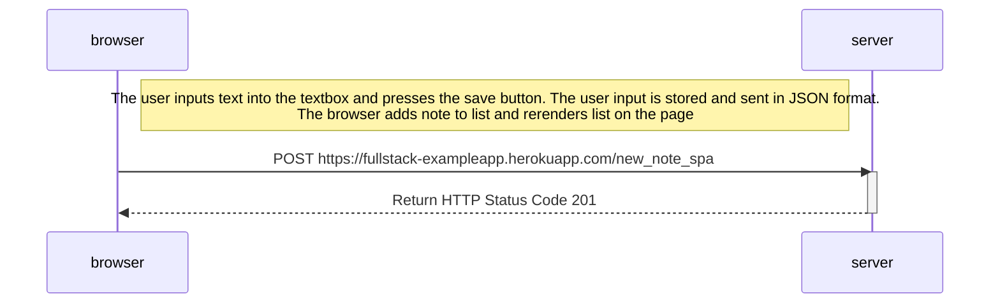

```mermaid
sequenceDiagram
    participant browser
    participant server

    Note right of browser: The user inputs text into the textbox and presses the save button. The user input is stored and sent in JSON format. <br>The browser adds note to list and rerenders list on the page
    browser->>server: POST https://fullstack-exampleapp.herokuapp.com/new_note_spa
    activate server
    server-->>browser: Return HTTP Status Code 201
    deactivate server
```
